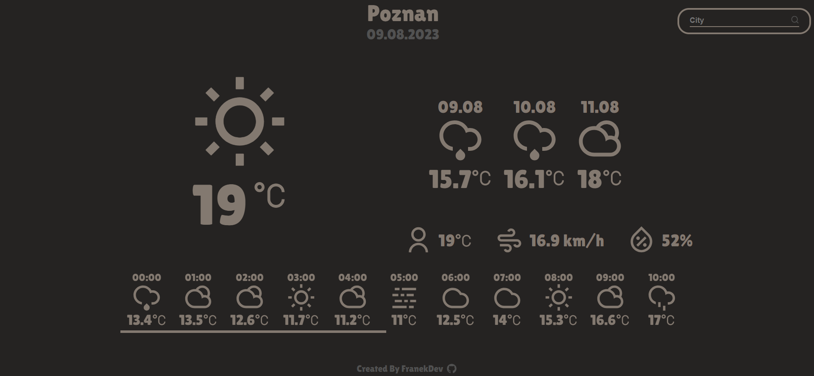

# Weather App

## [Live App](https://franekdev.github.io/weather-app/)

### Web application that fetches weather information from [weatherapi.com](https://www.weatherapi.com/) and displays them in minimal modern UI.

### Mobile UI

    
    

### Displayed info:

1. Current weather temp and icon
2. Average temperature for next three days
3. Additional information about current weather (feels like temp, wind speed and humidity)
4. 24 hour forecast
5. City and date

UI was designed in Figma.
